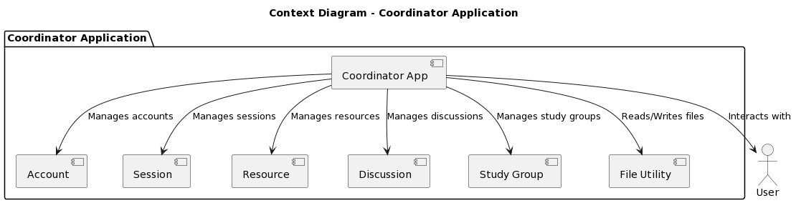
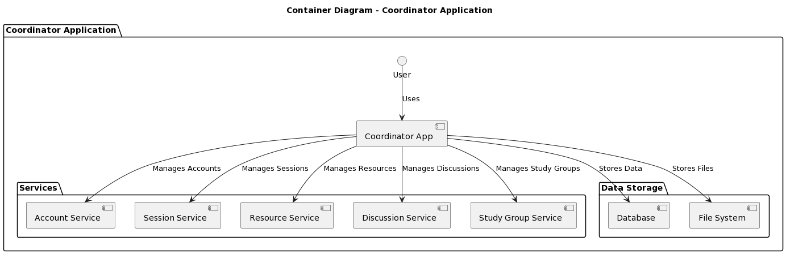
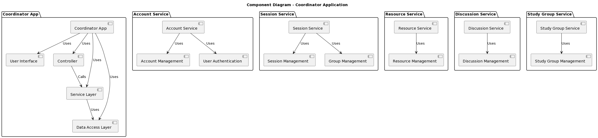
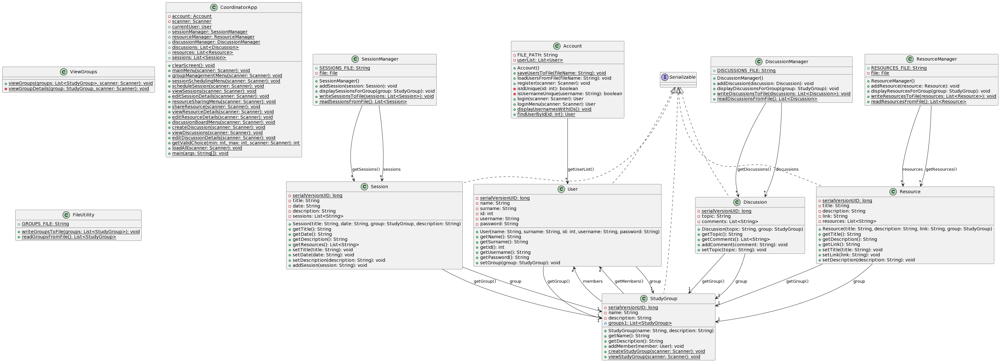
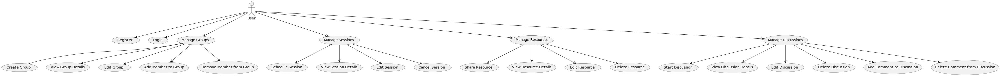
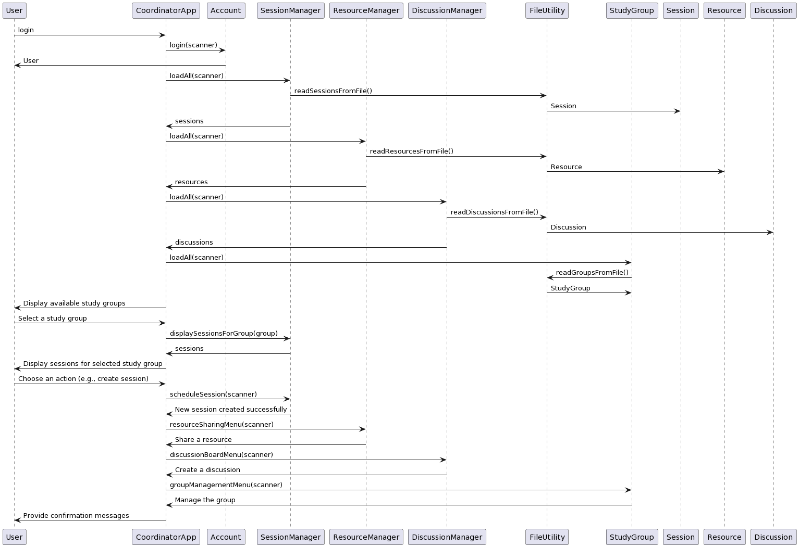

# Study Group Coordinator

## Project Description

The Study Group Coordinator organizes study groups, schedules sessions, shares resources, and facilitates discussions to enhance collaborative learning.
  
 ## Study Group Coordinator

**Group management: Organize study groups.**

**Session scheduling: Plan study sessions and topics.**

**Resource sharing: Distribute study materials.**

**Discussion board: Facilitate group discussions.**

## Releases

- [Latest Release](https://github.com/Ranademirci/StudyGroupCoordinator)

## Platforms

- 
- 
- 

### Test Coverage Ratios

| Coverage Type |                                                                        |                                              
| ------------- | ---------------------------------------------------------------------- | 
| Line Based    |      |
| Branch Based  |  |
| Method Based  |  |

### Documentation Coverage Ratios

|                    |                                                                   |
| ------------------ | ----------------------------------------------------------------- | 
| **Coverage Ratio** |  |

## Installation

No setup is required. Simply download and extract the files to a folder of your choice.

## Usage

Open program and use it. Interact menu with numbers.

## Contributing

This project is for academic purposes and is closed to contributions.

### Rana Demirci

## License

This project is not permitted for commercial usage.

## Dependencies

- Java

## Features

*Group management: Organize study groups.*

*Session scheduling: Plan study sessions and topics.*

*Resource sharing: Distribute study materials.*

*Discussion board: Facilitate group discussions.*

## Support

If you encounter any issues or have suggestions for improvements, please open an issue on the [project's GitHub repository](https://github.com/Ranademirci/StudyGroupCoordinator).

## Acknowledgments

- [Microsoft](https://visualstudio.microsoft.com/tr/vs/community/)
- [GitHub](https://github.com/)

## Diagrams

### Context

### Container

### Component

### Class

### Use-Case

### Sequence
